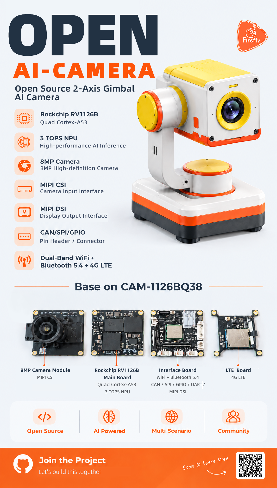

<div align="center">

# OPEN AI-CAMERA

**Open Source 2-Axis Gimbal AI Camera**

Built on Rockchip RV1126B · 3 TOPS INT8 NPU · Open Hardware

[](#-project-status)
[](#-hardware-specifications)
[](https://community.t-firefly.com/en)

English · [简体中文](locales/README.zh-CN.md)

</div>

---

## 📖 Overview

**OPEN AI-CAMERA** is an open-source 2-axis pan-tilt AI camera built on the Rockchip RV1126B platform. It is designed for **edge AI vision, real-time object tracking, scene capture and embedded vision research**.

A proper edge AI camera has to do three things well: **see clearly**, **stay steady**, and **think on-device**. OPEN AI-CAMERA ships all three out of the box — an 8MP sensor, an integrated 2-axis pan-tilt mechanism, and a 3 TOPS NPU capable of running quantized models locally without any cloud dependency.

<div align="center">

<a href="assets/17907585486100_en.png"></a>

</div>

---

## ✨ Key Features

| | Feature | Description |
|---|---|---|
| 🧠 | **On-device AI** | 3 TOPS INT8 NPU on RV1126B — run object detection, tracking and classification locally, no cloud round-trip |
| 🎥 | **8MP vision** | 3840×2160 sensor, FOV 123°±5°, 0.6m ~ ∞ focus, MIPI-CSI input |
| 🔄 | **2-Axis pan-tilt** | Integrated pan-tilt mechanism with motor control demo — tracking and positioning without external servo rigs |
| 🔧 | **Open source** | Open SDK source code and hardware design files, released as the roadmap progresses |
| 🌐 | **Flexible connectivity** | 1G RJ45, 2.4G/5G dual-band WiFi + BT 5.4, and 4G LTE |
| 🔌 | **Dual power input** | USB-C or 12V DC jack — works with a power bank, a bench supply or a robot power rail |
| 🗣️ | **Onboard audio** | 2 microphones + 8Ω 1W speaker for audio capture and playback |
| 💾 | **Local storage** | 16GB eMMC + MicroSD slot — store video and AI datasets right on the device |

**Open Source** · **AI Powered** · **Multi-Scenario** · **Community**

---

## 🔩 Hardware Specifications

| Item | Parameters | Notes |
|---|---|---|
| **SoC** | Rockchip RV1126B | Quad A53 @1.2GHz, 3 TOPS INT8 NPU, H.264/H.265 codec |
| **Memory** | 2GB / 4GB LPDDR4 | Optional |
| **Storage** | 16GB eMMC + MicroSD Slot | Local storage for video & AI datasets |
| **Camera** | 8MP Camera | 3840×2160, FOV 123°±5°, 0.6m ~ ∞ focus |
| **Display** | MIPI-DSI ×1 | Expandable video output |
| **Audio** | 2 Mics + 8Ω 1W Speaker | Onboard audio capture & playback |
| **Network** | 1G RJ45, 2.4G/5G WiFi + BT5.4, 4G LTE | Wired / wireless network |
| **USB** | USB3.0 Type-C | Data, power |
| **External IO** | CAN, GPIO, Debug port | Peripheral integration |
| **Pan-Tilt** | 2-Axis, integrated | Motor PTZ control demo planned |
| **Power** | USB-C / 12V Jack | Multi power option |

### Board Composition

The camera is built from four boards, based on the **CAM-1126BQ38** camera module platform:

| Board | Function |
|---|---|
| **8MP Camera Module** | 8MP camera with MIPI CSI input |
| **RV1126B Main Board** | Quad-core A53 + 3 TOPS NPU, the system brain |
| **Interface Board** | WiFi + BT 5.4, exposes CAN / SPI / GPIO / UART / MIPI-DSI interfaces |
| **LTE Board** | 4G LTE cellular connectivity |

---

## 🗺️ Roadmap

```
[x] Project Initialization & GitHub repo setup
[x] Project poster for community announcement
[ ] Release 3D mechanical structure CAD files (STEP / STL)
[ ] Release base firmware, motor PTZ control demo
[ ] Release NPU object detection & tracking sample code
[ ] Release full SDK and toolchain
[ ] Community contributed examples & tools
```

---

## 🎯 Use Cases

- **Edge AI vision** — deploy quantized detection / classification models locally on the 3 TOPS NPU
- **Real-time object tracking** — combine the 2-axis pan-tilt with NPU detection for closed-loop tracking
- **Scene capture & datasets** — 8MP capture with local storage for building vision datasets
- **Embedded vision research** — study a complete camera pipeline from sensor to NPU on open hardware
- **Education & maker projects** — a documented platform for teaching embedded vision and motor control
