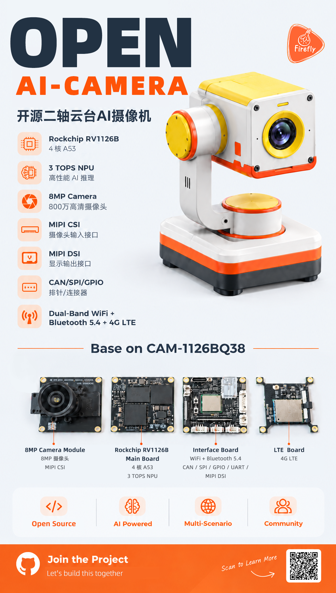

<div align="center">

# OPEN AI-CAMERA

**开源二轴云台 AI 摄像机**

基于 Rockchip RV1126B · 3 TOPS INT8 NPU · 开放硬件

[](#-项目状态)
[](#-硬件规格)
[](https://community.t-firefly.com)

[English](../README.md) · 简体中文

</div>

---

## 📖 项目简介

**OPEN AI-CAMERA** 是一台基于 Rockchip RV1126B 平台的开源二轴云台 AI 摄像机，面向 **端侧 AI 视觉、实时目标跟踪、场景采集与嵌入式视觉研究**。

一台合格的端侧 AI 摄像机要同时做好三件事：**看得清、看得稳、想得快**。OPEN AI-CAMERA 出厂即配齐——8MP 传感器负责看得清，一体化二轴云台负责看得稳，3 TOPS NPU 负责在本地跑量化模型、无需依赖云端。

<div align="center">

<a href="../assets/17907549752300.png"></a>

</div>

---

## ✨ 核心特性

| | 特性 | 说明 |
|---|---|---|
| 🧠 | **端侧 AI** | RV1126B 内置 3 TOPS INT8 NPU，目标检测、跟踪、分类模型本地推理，无云端往返延迟 |
| 🎥 | **8MP 视觉** | 3840×2160 传感器，FOV 123°±5°，对焦 0.6m ~ ∞，MIPI-CSI 输入 |
| 🔄 | **二轴云台** | 一体化云台结构，配套电机控制 Demo——跟踪与定位不再需要外接舵机自搭 |
| 🔧 | **开放源码** | 开放 SDK 源代码和硬件资料，随路线图逐步发布 |
| 🌐 | **多模连接** | 1G 以太网、2.4G/5G 双频 WiFi + BT 5.4、4G LTE |
| 🔌 | **双供电方案** | USB-C 或 12V DC 输入，移动电源、实验电源、机器人电源轨都能用 |
| 🗣️ | **板载音频** | 双麦克风 + 8Ω 1W 扬声器，支持拾音与回放 |
| 💾 | **本地存储** | 16GB eMMC + MicroSD 插槽，视频与 AI 数据集直接落盘 |

**Open Source** · **AI Powered** · **Multi-Scenario** · **Community**

---

## 🔩 硬件规格

| 项目 | 参数 | 备注 |
|---|---|---|
| **SoC** | Rockchip RV1126B | Quad A53 @1.2GHz，3 TOPS INT8 NPU，H.264/H.265 编解码 |
| **内存** | 2GB / 4GB LPDDR4 | 可选配 |
| **存储** | 16GB eMMC + MicroSD 插槽 | 本地存储视频与 AI 数据集 |
| **摄像头** | 8MP Camera | 3840×2160，FOV 123°±5°，0.6m ~ ∞ 对焦 |
| **显示** | MIPI-DSI ×1 | 可扩展视频输出 |
| **音频** | 2 麦克风 + 8Ω 1W 扬声器 | 板载拾音与回放 |
| **网络** | 1G RJ45、2.4G/5G WiFi + BT5.4、4G LTE | 有线 / 无线网络 |
| **USB** | USB3.0 Type-C | 数据与供电 |
| **外部 IO** | CAN、GPIO、Debug 口 | 外设集成 |
| **云台** | 二轴一体化 | 电机 PTZ 控制 Demo 规划中 |
| **供电** | USB-C / 12V DC | 多供电方案 |

### 板卡组成

整机基于 **CAM-1126BQ38** 摄像机模组平台，由四块板卡构成：

| 板卡 | 功能 |
|---|---|
| **8MP Camera Module** | 8MP 摄像头模组，MIPI CSI 输入 |
| **RV1126B Main Board** | 四核 A53 + 3 TOPS NPU，系统大脑 |
| **Interface Board** | WiFi + BT 5.4，引出 CAN / SPI / GPIO / UART / MIPI DSI 接口 |
| **LTE Board** | 4G LTE 蜂窝连接 |

---

## 🗺️ 项目路线图

```
[x] 立项 & GitHub 仓库搭建
[x] 项目海报发布，社区公告
[ ] 发布 3D 机械结构 CAD 文件（STEP / STL）
[ ] 发布基础固件与云台电机控制 Demo
[ ] 发布 NPU 目标检测与跟踪示例代码
[ ] 发布完整 SDK 与工具链
[ ] 社区贡献示例与工具
```

---

## 🎯 适用场景

- **端侧 AI 视觉** —— 把量化后的检测 / 分类模型跑在 3 TOPS NPU 上，端侧完成推理
- **实时目标跟踪** —— 二轴云台 + NPU 检测闭环，实现实时跟踪
- **场景采集与数据集** —— 8MP 采集 + 本地存储，用于构建视觉数据集
- **嵌入式视觉研究** —— 在开放硬件上研究从传感器到 NPU 的完整视觉链路
- **教学与创客项目** —— 一套有完整文档的平台，用于嵌入式视觉与电机控制教学
